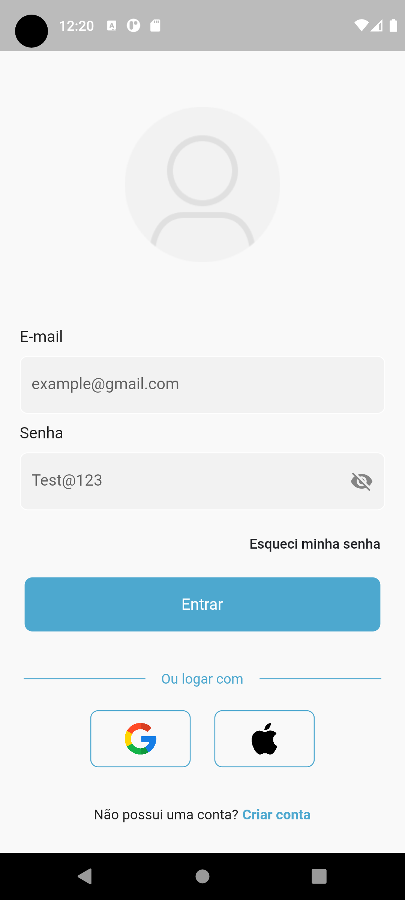

# Aplicativo de autenticação

Atividade Desenvolvimento Mobile. Tela já implementada no Flutter.

    

Link do projeto no figma. [Acesse aqui](https://www.figma.com/file/AQEQ33wK77UaplZ2QWleiH/Aula-Mobile?node-id=0%3A1&t=fYf7qAsEkpcFyKkJ-1)